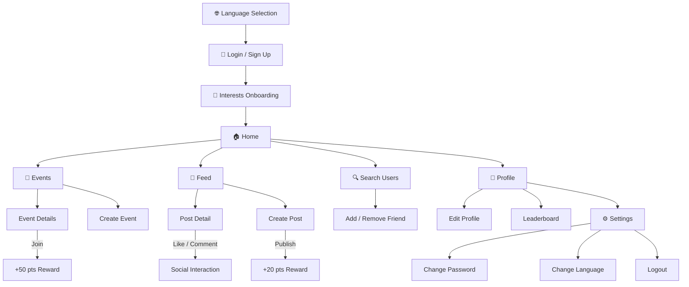

<p align="center">
  <h1 align="center">🌍 Impactly</h1>
  <p align="center">
    <strong>Where good intentions become real actions.</strong>
    <br/>
    A premium mobile platform that connects volunteers with causes that matter — one event, one post, one friendship at a time.
  </p>
  <p align="center">
    
    
    
    
    
  </p>
</p>

---

## 📖 The Story

> *Imagine you want to clean up a local beach, plant trees in your neighbourhood, or teach underprivileged kids — but you don't know where to start, or who to do it with.*

**Impactly** solves that. It is a social-impact ecosystem where:

1. **Organisers** create volunteer events and invite the community.
2. **Volunteers** discover, join, and earn reward points for participation.
3. **Everyone** shares their journey through posts, photos, likes, and comments — building a living feed of positive change.
4. **Friends** find each other, connect, and grow their impact network together.

The app rewards action with **Impact Points** and **Levels**, turning social good into a compelling, gamified experience.

---

## 🗺️ User Journey — A Visual Walkthrough

The following storyboard shows how a new user moves through the app from first launch to becoming an active community member.

```
┌─────────────────────────────────────────────────────────────────────────────────┐
│                                                                                 │
│   🌐 LANGUAGE       →   🔐 AUTH           →   🎯 ONBOARDING                    │
│   Select EN / HI        Login or Sign Up       Pick your interests              │
│                                                 (Education, Environment, etc.)   │
│                                                                                 │
└──────────────────────────────┬──────────────────────────────────────────────────┘
                               │
                               ▼
┌─────────────────────────────────────────────────────────────────────────────────┐
│                          🏠 HOME DASHBOARD                                      │
│                                                                                 │
│   "Hi, Parikshit! 👋  Ready to make an impact?"                                │
│                                                                                 │
│   ┌──────────────┐   ┌──────────────┐   ┌──────────────┐   ┌──────────────┐    │
│   │ 🧹 Cleaning  │   │ 🎓 Education │   │ 🐾 Animals   │   │ 🎵 Music     │    │
│   └──────────────┘   └──────────────┘   └──────────────┘   └──────────────┘    │
│                                                                                 │
│   Recently Added Events                                                         │
│   ┌─────────────────────────────────────────────────────────────────┐           │
│   │  🏖️ Beach Cleanup Drive          📍 Marine Drive    +100 pts  │           │
│   │  🌳 Tree Plantation              📍 Sanjay Gandhi    +75 pts  │           │
│   └─────────────────────────────────────────────────────────────────┘           │
│                                                                                 │
└───────────┬───────────┬───────────────┬───────────────┬─────────────────────────┘
            │           │               │               │
     🏠 Home    🔍 Search     📅 Events    📰 Feed     👤 Profile
```

### Screen-by-Screen Breakdown

| Step | Screen | What the user does |
|:----:|:-------|:-------------------|
| **1** | **Language Selection** | Chooses English or Hindi. Preference is saved locally. |
| **2** | **Login / Sign Up** | Creates an account (name, username, email, phone, city) or logs back in. |
| **3** | **Interests Onboarding** | Selects personal interests to personalise event recommendations. |
| **4** | **Home Dashboard** | Sees a greeting, category chips, and a curated list of recent events. |
| **5** | **Event Discovery** | Browses all events, filters by category, searches by name, and taps to view details. |
| **6** | **Event Details** | Reads full description, sees organiser info, reward points, and hits **"Join Event"**. |
| **7** | **Create Event** | Organisers fill in title, description, category, location, date, and reward points. |
| **8** | **Community Feed** | Scrolls a premium card-based feed of event updates from all users. |
| **9** | **Post Detail** | Taps a post → views full content & image → likes ❤️ or leaves a comment 💬. |
| **10** | **Create Post** | Selects a joined event, writes an update, attaches a photo, and publishes. |
| **11** | **User Search** | Types a name or username → finds community members → taps **"Add Friend"**. |
| **12** | **Profile** | Views Impact Points, Level, post count, interests, and an Instagram-style stats bar. |
| **13** | **Leaderboard** | Sees the top-ranked users by Impact Points across the entire platform. |
| **14** | **Settings** | Changes password, switches language, or logs out securely. |

---

## ✨ Feature Highlights

### 🎮 Gamified Impact System
Every action is rewarded. Users earn **Impact Points** that contribute to their overall **Level**, creating a sense of progression and healthy competition.

| Action | Reward |
|:-------|-------:|
| Join an event | **+50 pts** |
| Publish a post | **+20 pts** |
| Level up threshold | **Every 500 pts** |

### 🔍 Smart People Search
Find anyone on the platform by typing their **name** or **@username**. The search queries both fields simultaneously using Parse Server's compound `OR` queries, excluding the current user from results.

### 🤝 Friendship System
Built on Parse Server **Relations** — a scalable, many-to-many data model. Add or remove friends with a single tap. Friendship status syncs in real-time with the backend.

### 🌐 Bilingual by Design
Every UI string is externalised into ARB files and auto-generated into type-safe Dart classes. Event descriptions and post content are also translatable on-the-fly using a built-in Translation Service.

| Language | Code | Coverage |
|:---------|:----:|:--------:|
| English | `en` | 100% |
| Hindi | `hi` | 100% |

---

## 🛠️ Tech Stack

| Layer | Technology | Purpose |
|:------|:-----------|:--------|
| **Framework** | Flutter 3.x / Dart 3.x | Cross-platform UI |
| **Backend** | Parse Server (Back4App) | Auth, database, file storage |
| **SDK** | `parse_server_sdk_flutter` | Parse API integration |
| **State** | Provider | Reactive state management |
| **Localisation** | `flutter_localizations` + ARB | Multi-language support |
| **Translation** | `translator` | On-the-fly content translation |
| **Images** | `cached_network_image` | Efficient image loading & caching |
| **Media** | `image_picker` | Camera & gallery access |
| **Config** | `flutter_dotenv` | Secure env variable management |
| **Storage** | `shared_preferences` | Persistent local settings |

---

## 📂 Project Architecture

The codebase follows a **feature-first** architecture. Each feature is self-contained with its own screens and widgets, while shared logic lives in `core/`.

```
lib/
│
├── core/                          # Shared application foundation
│   ├── config/                    #   → Environment variables (Env class)
│   ├── constants/                 #   → App-wide static values
│   ├── models/                    #   → Shared data models
│   ├── navigation/                #   → MainScreen with BottomNavigationBar
│   ├── providers/                 #   → EventProvider, LocaleProvider
│   ├── services/                  #   → ParseService, TranslationService
│   └── theme/                     #   → AppTheme (colours, typography)
│
├── features/                      # Feature modules (screens + widgets)
│   ├── auth/                      #   → LoginScreen, SignupScreen
│   ├── events/                    #   → EventsScreen, EventDetails, CreateEvent
│   ├── feed/                      #   → FeedScreen, PostDetail, CreatePost
│   ├── home/                      #   → Home dashboard with categories
│   ├── language/                  #   → Language selection screen
│   ├── leaderboard/               #   → Global points leaderboard
│   ├── onboarding/                #   → Interest selection on first launch
│   ├── profile/                   #   → Profile, EditProfile, Settings, Password
│   └── social/                    #   → User search & friendship management
│
├── l10n/                          # Localisation
│   ├── app_en.arb                 #   → English strings (source of truth)
│   ├── app_hi.arb                 #   → Hindi strings
│   ├── app_localizations.dart     #   → Auto-generated base class
│   ├── app_localizations_en.dart  #   → Auto-generated EN implementation
│   └── app_localizations_hi.dart  #   → Auto-generated HI implementation
│
└── main.dart                      # App entry point & Parse initialisation
```

---

## 🗄️ Database Schema (Parse Server)

| Class | Key Fields | Purpose |
|:------|:-----------|:--------|
| `_User` | `username`, `email`, `fullName`, `phone`, `city`, `profilePicture`, `interests`, `points`, `level`, `friends` (Relation) | User accounts & social graph |
| `Events` | `title`, `description`, `category`, `location`, `date`, `points`, `createdBy` (Pointer→User) | Volunteer events |
| `UserEvents` | `user` (Pointer), `event` (Pointer), `joinedAt` | Join records (many-to-many) |
| `Posts` | `content`, `image` (File), `likes` (Array), `createdBy` (Pointer), `event` (Pointer) | Feed posts |
| `Comments` | `text`, `user` (Pointer), `post` (Pointer) | Post comments |

---

## 🚀 Getting Started

### Prerequisites

| Requirement | Version |
|:------------|:--------|
| Flutter SDK | ≥ 3.0.0 |
| Dart SDK | ≥ 3.0.0 |
| Parse Server | Any (Back4App recommended) |

### Step 1 — Clone & Install

```bash
git clone https://github.com/your-username/impactly.git
cd impactly
flutter pub get
```

### Step 2 — Configure Environment

Create a `.env` file in the project root:

```env
PARSE_APP_ID=your_parse_app_id
PARSE_CLIENT_KEY=your_parse_client_key
PARSE_SERVER_URL=https://parseapi.back4app.com
```

> **Note**: Never commit `.env` to version control. It is already included in `.gitignore`.

### Step 3 — Generate Localisation Files

```bash
flutter gen-l10n
```

### Step 4 — Run

```bash
# On a connected device or emulator
flutter run
```

---

## 🧪 Parse Server Setup

If you are using **Back4App**, create the following classes in your dashboard:

1. **Events** — Add columns: `title` (String), `description` (String), `category` (String), `location` (String), `date` (Date), `points` (Number), `createdBy` (Pointer→_User).
2. **UserEvents** — Add columns: `user` (Pointer→_User), `event` (Pointer→Events), `joinedAt` (Date).
3. **Posts** — Add columns: `content` (String), `image` (File), `likes` (Array), `createdBy` (Pointer→_User), `event` (Pointer→Events).
4. **Comments** — Add columns: `text` (String), `user` (Pointer→_User), `post` (Pointer→Posts).
5. **_User** — Add columns: `fullName` (String), `phone` (String), `city` (String), `profilePicture` (File), `interests` (Array), `points` (Number), `level` (Number), `friends` (Relation→_User).

---

## 📊 Navigation Map



---

## 🤝 Contributing

We welcome contributions from developers, designers, and impact enthusiasts!

1. **Fork** the repository
2. **Create** a feature branch (`git checkout -b feature/amazing-feature`)
3. **Commit** your changes (`git commit -m 'Add amazing feature'`)
4. **Push** to the branch (`git push origin feature/amazing-feature`)
5. **Open** a Pull Request

---

## 📄 License

This project is licensed under the **MIT License** — see the [LICENSE](LICENSE) file for details.

---

<p align="center">
  <strong>Built with ❤️ to make the world a little better.</strong>
  <br/>
  <em>Impactly — Turn intention into impact.</em>
</p>
