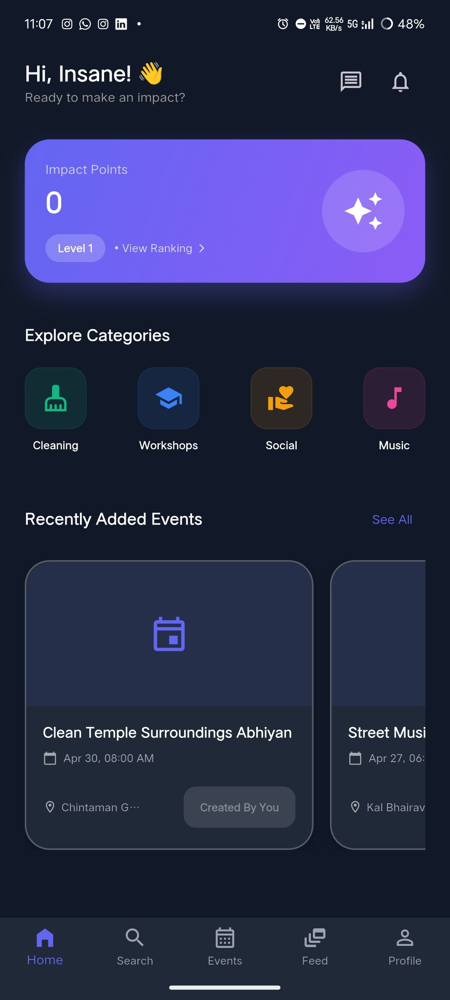
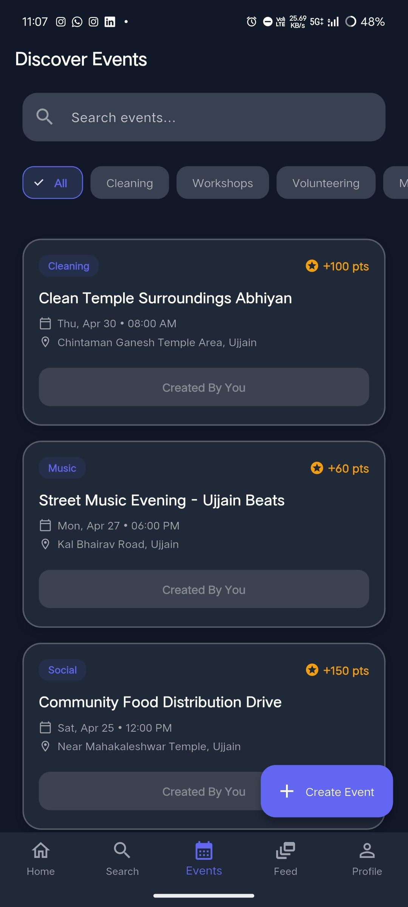
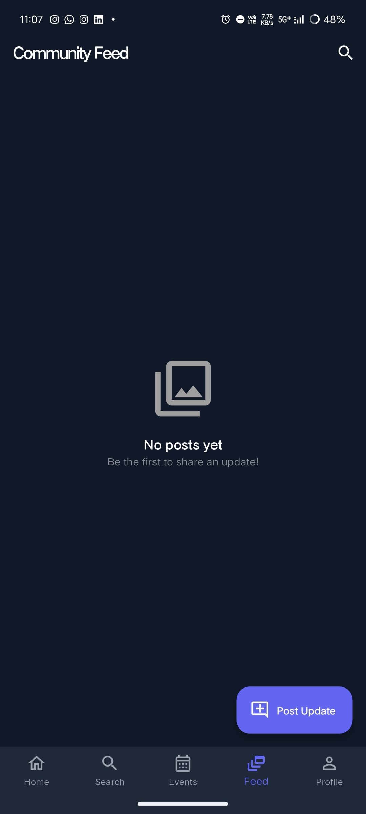
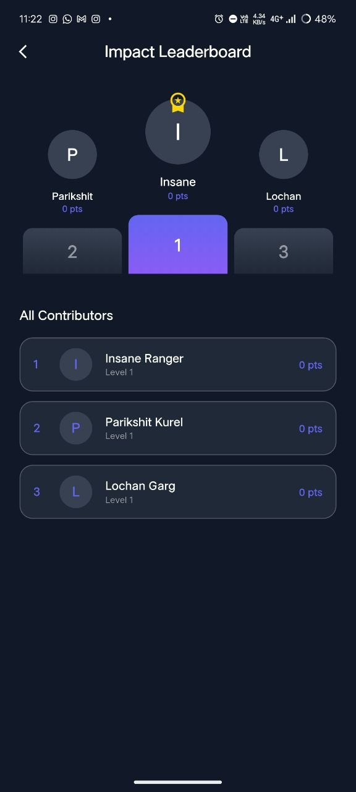
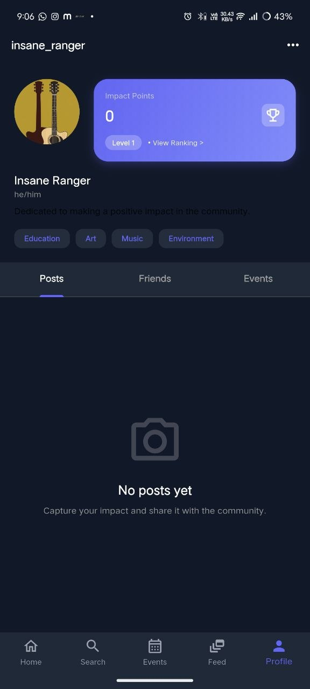
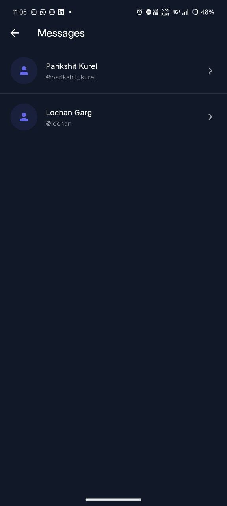
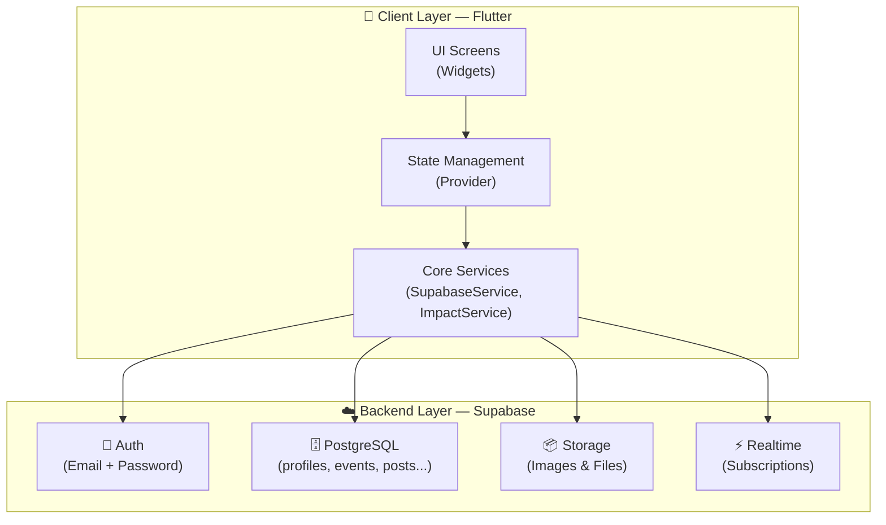
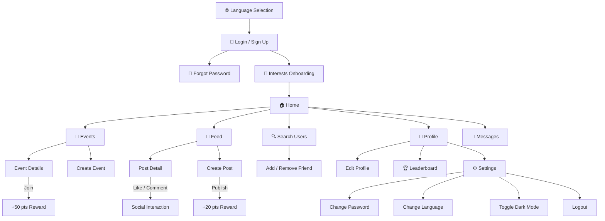

<p align="center">
  
  <h1 align="center">🌍 Impactly</h1>
  <p align="center">
    <strong>Where good intentions become real actions.</strong>
    <br/>
    A gamified social-impact mobile platform that connects volunteers with causes that matter.
  </p>
  <p align="center">
    
    
    
    
    
    
  </p>
  <p align="center">
    
    
    
    
  </p>
</p>

---

## 📌 Problem Statement

Despite growing awareness of social responsibility among youth, a significant disconnect exists between the **desire to volunteer** and the **ability to take meaningful action**. University students frequently express interest in community service, yet participation remains low — not due to a lack of willingness, but because of **fragmented information, scattered platforms, and no centralised event discovery system**. Our primary research (survey of 20 respondents) confirmed that 95% of students have missed volunteer opportunities due to insufficient information, and 60% struggle to find events matching their interests. **Impactly** addresses this gap by providing a dedicated, mobile-first platform with smart event filtering, gamified engagement, a community feed, and a trust-building social network — all tailored for the Indian university student demographic.

---

## 👥 Team Members

| Name | Student ID | Role | Key Responsibilities |
|:-----|:-----------|:-----|:---------------------|
| **Parikshit Kurel** | PU02424EUG10010 | Full-Stack Developer & Technical Lead | System architecture, Supabase integration, authentication, event management & deployment |
| **Lochan Garg** | PU02424EUG10018 | Full-Stack Developer & Design Lead | User research, Miro wireframing, community feed implementation, sociometric features & QA testing |

> **Collaborative Note:** Both team members worked equally across all phases of the project — from research and design to development, testing, and documentation. While roles above reflect primary coordination areas, all code, design decisions, and documentation were produced through pair programming and collaborative review.

---

## 🎬 Demo Video

[](https://youtu.be/RvpVpfIHSnM)

> **Click the badge above to watch the full walkthrough on YouTube.**

---

## 📸 Screenshots

<p align="center">
  
  &nbsp;&nbsp;
  
  &nbsp;&nbsp;
  
</p>
<p align="center">
  <em>Home Dashboard &nbsp;·&nbsp; Event Discovery &nbsp;·&nbsp; Community Feed</em>
</p>
<br/>
<p align="center">
  
  &nbsp;&nbsp;
  
  &nbsp;&nbsp;
  
</p>
<p align="center">
  <em>Leaderboard &nbsp;·&nbsp; Profile &nbsp;·&nbsp; Direct Messages</em>
</p>

---

## 🛠️ Tech Stack

| Layer | Technology | Version | Purpose |
|:------|:-----------|:--------|:--------|
| **Framework** | Flutter | 3.41.6 | Cross-platform mobile UI |
| **Language** | Dart | ≥ 3.0.0 | Primary programming language |
| **Backend** | Supabase | Cloud | Auth, PostgreSQL database, Storage, Realtime |
| **State Management** | Provider | 6.1.2 | Reactive state with `ChangeNotifier` |
| **Localisation** | `flutter_localizations` + ARB | Built-in | Multi-language (English & Hindi) |
| **Translation** | `translator` | 1.0.4 | On-the-fly content translation |
| **Image Caching** | `cached_network_image` | 3.4.1 | Efficient network image loading |
| **Media** | `image_picker` + `image_cropper` | 1.1.2 / 8.0.2 | Camera, gallery, and image cropping |
| **Environment** | `flutter_dotenv` | 5.2.1 | Secure `.env` variable management |
| **Local Storage** | `shared_preferences` | 2.5.2 | Persistent settings (language, theme) |
| **Deep Linking** | `app_links` | 7.0.0 | Password recovery flow handling |
| **HTTP** | `http` | 1.2.1 | REST API calls |
| **App Info** | `package_info_plus` | 8.0.1 | Version detection for update checks |
| **URLs** | `url_launcher` | 6.3.1 | Opening external links |

---

## 🚀 Setup & Run Instructions

> Tested on a clean Windows 11 machine with Flutter 3.41.6.

### Prerequisites

| Tool | Minimum Version |
|:-----|:----------------|
| Flutter SDK | ≥ 3.0.0 |
| Dart SDK | ≥ 3.0.0 (bundled with Flutter) |
| Android Studio / VS Code | Latest |
| A Supabase project | [supabase.com](https://supabase.com) |

### Step 1 — Clone the repository

```bash
git clone https://github.com/Lochangarg/Impactly.git
cd Impactly
```

### Step 2 — Install dependencies

```bash
flutter pub get
```

### Step 3 — Configure environment variables

```bash
cp .env.example .env
```

Open `.env` and fill in your Supabase credentials:

```env
SUPABASE_URL=https://your-project.supabase.co
SUPABASE_ANON_KEY=your-anon-key-here
```

> ⚠️ **Never commit `.env`** — it is already excluded via `.gitignore`.

### Step 4 — Generate localisation files

```bash
flutter gen-l10n
```

### Step 5 — Run the app

```bash
flutter run
```

For a specific platform:

```bash
flutter run -d chrome    # Web
flutter run -d windows   # Windows desktop
flutter run -d <device>  # Connected Android/iOS device
```

---

## 📂 Project Architecture

The codebase follows a **feature-first** architecture pattern. Each feature module is self-contained with its own screens and widgets, while all shared logic resides in `core/`.

```
Impactly/
├── lib/                               # All source code (Flutter convention)
│   ├── core/                          # Shared application foundation
│   │   ├── config/                    #   → Env class (Supabase URL & keys)
│   │   ├── constants/                 #   → App-wide static values
│   │   ├── models/                    #   → Data models (Event, UserStats, etc.)
│   │   ├── navigation/                #   → MainScreen with BottomNavigationBar
│   │   ├── providers/                 #   → EventProvider, LocaleProvider, ThemeProvider
│   │   ├── services/                  #   → SupabaseService, ImpactService, LeaderboardService
│   │   ├── theme/                     #   → AppTheme (light/dark, colours, typography)
│   │   └── utils/                     #   → LevelUtils, VersionUtils
│   │
│   ├── features/                      # Feature modules
│   │   ├── auth/                      #   → Login, Signup, ForgotPassword, ResetPassword
│   │   ├── chat/                      #   → ChatScreen, DirectMessagesScreen
│   │   ├── events/                    #   → Events discovery, details, creation, award approval
│   │   ├── feed/                      #   → Community feed, post creation, likes & comments
│   │   ├── home/                      #   → Dashboard with category chips & notifications
│   │   ├── language/                  #   → Language selection (EN / HI)
│   │   ├── leaderboard/               #   → Global Impact Points ranking
│   │   ├── onboarding/                #   → Interest selection on first launch
│   │   ├── profile/                   #   → Profile, edit, settings, account info, password
│   │   ├── social/                    #   → User search & friendship management
│   │   └── update/                    #   → OTA update checker
│   │
│   ├── l10n/                          # Localisation (ARB → auto-generated Dart)
│   ├── models/                        # Additional shared models
│   ├── routes/                        # Centralised route definitions
│   └── main.dart                      # Entry point & Supabase initialisation
│
├── docs/                              # Design assets & technical documentation
│   ├── Impactly_Project_Report.md     #   → Comprehensive academic project report
│   ├── MiroDesign application.pdf     #   → Wireframes & high-fidelity mockups
│   ├── DATABASE.md                    #   → Full database schema documentation
│   └── SUPABASE_MIGRATION_PLAN.md     #   → SQL migration reference
│
├── assets/                            # App icons, screenshots, images
│   ├── icons/                         #   → App icon (Impactly_app_icon.png)
│   └── screenshots/                   #   → UI screenshots for documentation
│
├── android/                           # Android platform files
├── ios/                               # iOS platform files
├── web/                               # Web platform files
├── windows/                           # Windows platform files
│
├── .env.example                       # Environment variable template
├── .gitignore                         # Excludes .env, build/, .gradle, etc.
├── CONTRIBUTING.md                    # Branching strategy & PR process
├── LICENSE                            # MIT License
├── pubspec.yaml                       # Flutter dependencies
└── README.md                          # This file
```

> **Note:** Source code lives in `lib/` rather than `/src` or `/app`. This is the **standard Flutter convention** required by Flutter's build system, tooling, and all major IDEs.

---

## 🗄️ Database Schema

The backend uses **Supabase** with a **PostgreSQL** database. All tables have **Row Level Security (RLS)** enabled.

| Table | Key Columns | Purpose |
|:------|:-----------|:--------|
| `profiles` | `id`, `full_name`, `username`, `phone`, `city`, `profile_picture`, `interests[]`, `points`, `level` | User profiles (linked to `auth.users`) |
| `events` | `id`, `title`, `description`, `category`, `location`, `date`, `points`, `created_by` | Volunteer events |
| `user_events` | `user_id`, `event_id`, `joined_at` | Event participation records |
| `posts` | `id`, `content`, `image_url`, `likes[]`, `created_by`, `event_id` | Community feed posts |
| `comments` | `id`, `text`, `user_id`, `post_id` | Post comments |
| `friends` | `user_id`, `friend_id` | Social graph (friendships) |
| `messages` | `sender_id`, `receiver_id`, `content`, `created_at` | Direct messaging |
| `notifications` | `receiver_id`, `sender_id`, `type`, `status` | System & social alerts |

> Full schema documentation → [`docs/DATABASE.md`](docs/DATABASE.md)

---

## ✨ Key Features

### 🎮 Gamified Impact System
Users earn **Impact Points** for every meaningful action, driving healthy competition through **Levels** and a global **Leaderboard**.

| Action | Points |
|:-------|-------:|
| Join a volunteer event | **+50** |
| Publish a community post | **+20** |
| Level up threshold | **Every 500 pts** |

### 📅 Event Discovery & Management
- Browse events by category (Education, Environment, Animals, Health, etc.)
- Search with real-time text filtering
- Join events with a single tap — points are awarded instantly
- Create events with title, description, category, location, date, and reward points

### 📰 Social Community Feed
- Share volunteer experiences with photos, text, and event tags
- Like ❤️ and comment 💬 on posts from the community
- Premium card-based layout inspired by modern social platforms

### 💬 Direct Messaging
- Private one-on-one conversations between community members
- Message history with real-time updates via Supabase Realtime

### 🤝 Friendship System
- Search users by name or @username
- Add/remove friends with a single tap
- Friend count displayed on profile

### 🌐 Bilingual Support
- Full English and Hindi localisation (100% coverage)
- On-the-fly content translation via built-in Translation Service
- Language preference persisted locally

### 🌙 Dark Mode
- Complete dark theme with deep charcoal palette
- Toggle from Settings — preference saved across sessions

---

## 📊 Architecture Diagram



---

## 🗺️ Navigation Map



---

## ⚠️ Known Limitations

| Limitation | Details |
|:-----------|:--------|
| **Network Required** | All features require an active internet connection; no offline mode is implemented. |
| **Text-based Location** | Event location is a text field; map/GPS integration is not yet available. |
| **Notification Latency** | Push notifications may have slight delays depending on device and network. |
| **Single Language Content** | While the UI is fully bilingual, user-generated content (posts) is in the author's language only (translation is on-the-fly). |

## 🔮 Future Roadmap

- 🗺️ **Map Integration** — Visualise events on an interactive map with location-based filtering
- 🏅 **Badges & Certificates** — Verifiable digital certificates for volunteering milestones
- 📴 **Offline Mode** — Local caching of events and posts for intermittent connectivity
- 🤖 **AI Recommendations** — Personalised event suggestions powered by activity analysis
- 🔔 **Push Notifications** — Native push via Firebase Cloud Messaging

---

## 🤝 Contributing

Please see [`CONTRIBUTING.md`](CONTRIBUTING.md) for our branching strategy, commit message conventions, and pull request process.

---

## 📄 License

This project is licensed under the **MIT License** — see the [`LICENSE`](LICENSE) file for details.

---

<p align="center">
  <strong>Built with ❤️ by Parikshit Kurel & Lochan Garg</strong>
  <br/>
  <em>Impactly — Turn intention into impact.</em>
  <br/><br/>
  <strong>Avantika University · School of Engineering · BCS4601 · 2025–2026</strong>
</p>
