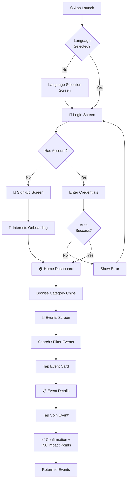
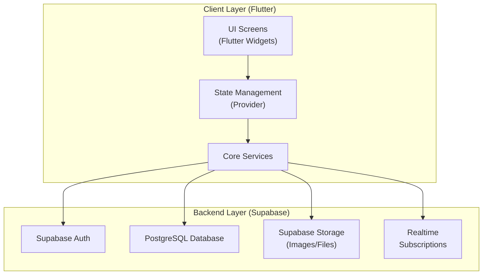

# **IMPACTLY — PROJECT REPORT**

---

## **Cover Page**

|||
|:--|:--|
| **Project Title** | Impactly — Where Good Intentions Become Real Actions |
| **Application Name** | Impactly |
| **Module Code** | BCS4601 — Design Project (Mobile Application) |
| **Academic Year** | 2025–2026 |
| **Institution** | Avantika University · School of Engineering |
| **Submission Date** | April 8, 2026 |

### Team Members

| # | Name | Student ID | Role |
|:-:|:-----|:-----------|:-----|
| 1 | `[Your Name]` | `[Student ID]` | `[Role]` |
| 2 | `[Team Member 2]` | `[Student ID]` | `[Role]` |
| 3 | `[Team Member 3]` | `[Student ID]` | `[Role]` |
| 4 | `[Team Member 4]` | `[Student ID]` | `[Role]` |

> [!IMPORTANT]
> **Placeholders above need to be filled in with actual team member names, student IDs, and roles.**

---

## **1. Project Overview**
*(200–300 words)*

**Impactly** is a cross-platform mobile application designed to bridge the gap between socially motivated individuals and meaningful volunteer opportunities. Built with **Flutter 3.x** and powered by a **Supabase** backend, Impactly serves as a unified social-impact ecosystem where organisers can create volunteer events, and users can discover, join, and share their participation through a community-driven feed.

**Elevator Pitch:**
*"Impactly is a gamified social-impact platform that connects volunteers with causes that matter — making it easy to discover events, earn rewards, and build a community of changemakers, all from a single mobile app."*

**Core Value Proposition:**
Unlike scattered social media posts and fragmented volunteer directories, Impactly centralises the entire volunteer lifecycle — from event discovery and registration to post-event sharing and community engagement. The platform incentivises participation through a **gamified Impact Points and Levelling system**, turning social good into a compelling, rewarding experience.

**Target User Group:**
The primary audience is university students and young professionals aged 18–25 who are socially aware and motivated to participate in volunteer activities but struggle to discover relevant opportunities through existing channels. Secondary users include event organisers (NGOs, university clubs, community groups) who need a streamlined platform to promote their initiatives.

**Operating Platform:**
Impactly is built as a cross-platform application supporting both **iOS and Android** devices. Developed with the Flutter framework, the app ensures a consistent, premium user experience across both major mobile operating systems with a single codebase. The application also supports **bilingual interfaces** (English and Hindi) to maximise accessibility.

---

## **2. Problem Statement**
*(300–400 words)*

### The Real-World Problem

Despite the growing awareness of social responsibility among youth, a significant disconnect exists between the desire to volunteer and the ability to take meaningful action. University students and young professionals frequently express interest in community service — yet participation rates remain disproportionately low. The root cause is not a lack of willingness but rather a **lack of accessible, centralised, and trustworthy platforms** for discovering volunteer opportunities.

### Who Experiences It?

This problem primarily affects **young adults aged 18–25**, particularly university students, who form the most socially active and digitally engaged demographic. Our primary research (survey of 20 respondents) confirmed that **100% of respondents fell within the 18–22 age bracket** (with one respondent above 30), and the overwhelming majority identified as students. These individuals are eager to contribute to social causes but face systemic barriers in finding and engaging with relevant opportunities.

### Pain Points

Our survey data revealed the following key pain points:

1. **Scattered Information (65% of respondents):** Volunteer event information is fragmented across multiple social media platforms, WhatsApp groups, college notice boards, and websites. There is no single source of truth.

2. **Difficulty Finding Relevant Events (60% of respondents):** Even when events are posted, users struggle to filter and discover opportunities aligned with their interests, location, and availability.

3. **Lack of Trust (35% of respondents):** Users expressed distrust in the authenticity and legitimacy of events discovered through informal social media channels.

4. **No Feedback or Confirmation (30% of respondents):** Existing platforms provide no post-registration feedback, confirmation mechanisms, or acknowledgement of participation — leading to disengagement.

5. **Confusing Navigation (20% of respondents):** The few platforms that do aggregate volunteer opportunities often suffer from poor user interfaces and unintuitive navigation.

### Gap in Current Solutions

Currently, most users rely on **Instagram, WhatsApp, and word-of-mouth** to discover events (as confirmed by 80%+ of survey respondents). While these channels are effective for awareness, they lack critical features: no structured filtering, no event management tools, no progress tracking, no community interaction, and no recognition system. Existing dedicated platforms (such as Unstop or VolunteerMatch) are either focused on professional development rather than community service, or are not localised for the Indian university context.

**Impactly addresses this gap** by providing a dedicated, mobile-first platform with advanced filtering, gamified engagement, community interaction, and a trust-building feedback system — all tailored to the Indian university student demographic.

---

## **3. Team & Roles**

> [!WARNING]
> **Fill in the actual team member details below. Contribution must total 100%.**

| # | Team Member | Role | Primary Responsibilities | Contribution (%) |
|:-:|:------------|:-----|:-------------------------|:-----------------:|
| 1 | `[Name 1]` | Project Lead / Full-Stack Developer | Project management, Flutter development, Supabase integration, deployment | `[XX]%` |
| 2 | `[Name 2]` | UI/UX Designer | Wireframing, Miro design, visual design, user research | `[XX]%` |
| 3 | `[Name 3]` | Frontend Developer | Screen implementation, state management, localisation | `[XX]%` |
| 4 | `[Name 4]` | Research & Testing | Survey design, user testing, documentation, report writing | `[XX]%` |
| | | | **Total** | **100%** |

---

## **4. Design Methodology**
*(400–500 words)*

### Design Process: Design Thinking Framework

The development of Impactly followed the **Design Thinking** methodology — a human-centred, iterative design framework that emphasises empathy, ideation, and rapid prototyping. This framework was chosen because it prioritises understanding user needs before jumping to solutions, which was essential for a social-impact application where user motivation and engagement are critical success factors.

### Phase Breakdown

#### Phase 1: Empathise (Week 1–2)
The first phase focused on deeply understanding the target user group. We conducted:
- **Secondary Research:** Reviewed 7 academic articles and research papers on volunteer engagement, digital platform usability, gamification, and the Technology Acceptance Model (TAM).
- **Primary Research:** Designed and distributed a structured Google Forms survey targeting university students, collecting 20 responses across 11 questions covering demographics, current behaviour, pain points, feature preferences, and willingness to adopt a new platform.
- **Contextual Inquiry:** Informal conversations with peers about their volunteering experiences and frustrations with existing platforms.

#### Phase 2: Define (Week 2–3)
Survey data was analysed to identify patterns and key insights. We synthesised findings into:
- **User Personas** (2 detailed personas — see Section 6)
- **Problem Statement** articulating the core challenge (see Section 2)
- **Key Design Requirements:** Event filtering, simplified navigation, gamification, feedback mechanisms, and community features

#### Phase 3: Ideate (Week 3–4)
Brainstorming sessions generated multiple solution concepts. Key decisions made during ideation:
- **Advanced Filtering System** → Directly addressing the "hard to find relevant events" pain point (60% of respondents)
- **Gamification via Impact Points & Levels** → Inspired by research showing improved short-term engagement (IJERT, 2025)
- **Community Feed with Social Interaction** → Based on the finding that 80%+ of users already use social media for event discovery
- **Bilingual Support** → To maximise accessibility for the Indian university audience

#### Phase 4: Prototype (Week 4–7)
High-fidelity prototypes were created using **Miro** for the design framework and information architecture. Simultaneously, a working Flutter prototype was developed iteratively, with screens being built and tested in sequence:
1. Authentication flow → 2. Home Dashboard → 3. Event Management → 4. Community Feed → 5. Social Features → 6. Profile & Gamification

#### Phase 5: Test (Week 7–8)
Usability testing was conducted with 3 real users (see Section 10). Findings were used to iterate on:
- Navigation flow simplification
- Event card information hierarchy
- Feedback confirmation mechanisms

### Timeline

| Week | Phase | Key Activities |
|:----:|:------|:---------------|
| 1–2 | Empathise | Literature review, survey design & distribution |
| 2–3 | Define | Data analysis, persona creation, problem definition |
| 3–4 | Ideate | Brainstorming, feature prioritisation, design decisions |
| 4–7 | Prototype | Miro wireframes, Flutter development, iterative builds |
| 7–8 | Test | Usability testing, feedback incorporation, final polish |

### Key Decision Points

1. **Supabase over Parse Server:** Initially prototyped with Parse Server (Back4App), but migrated to Supabase for better authentication, real-time capabilities, and PostgreSQL flexibility.
2. **Provider over Riverpod:** Chose Provider for state management due to its simplicity and team familiarity, avoiding unnecessary complexity.
3. **Gamification Depth:** Decided on a points-and-levels system rather than full badge architecture, based on survey feedback showing moderate interest in rewards (average rating: 3.05/5).

---

## **5. User Research**
*(400–600 words)*

### Survey Methodology

Primary user research was conducted through a structured online survey distributed via **Google Forms**. The survey, titled *"Impactly – Social Impact App Survey"*, was designed to understand how people discover and participate in social and community activities such as volunteering, events, and campaigns.

**Distribution:** The survey was shared through personal networks, university WhatsApp groups, and social media channels, targeting the primary user demographic (university students aged 18–25).

**Respondents:** A total of **20 valid responses** were collected, meeting the minimum threshold of 15 respondents required for this deliverable.

### Survey Design

The survey comprised **11 questions** (exceeding the minimum requirement of 10), incorporating a mix of question types:

| Question Type | Count | Examples |
|:--------------|:-----:|:--------|
| Multiple Choice | 4 | Age group, occupation, participation frequency, willingness to use |
| Checkbox (Multi-select) | 4 | Discovery channels, challenges, desired features |
| Likert Scale (1–5) | 2 | Ease of discovery, importance of rewards |
| Open-ended | 1 | Suggested improvements for existing platforms |

The survey covered the following domains: **demographics** (age, occupation), **current behaviour** (discovery methods, participation frequency), **pain points** (challenges faced), **feature preferences** (desired app features), and **willingness to adopt** (interest in using Impactly).

### Summary of Key Findings

#### Finding 1: Social Media Dominance in Event Discovery
**75% of respondents** use Instagram as their primary channel for discovering volunteer events. WhatsApp (45%) and college/university networks (45%) were the next most common channels. Only 20% used dedicated websites.

→ *Design Implication:* Impactly's community feed was designed to replicate the familiar social media experience, with card-based posts, likes, comments, and image sharing.

#### Finding 2: Moderate Participation but High Drop-off
- Very often: 25% | Sometimes: 35% | Rarely: 30% | Never: 5%
- Despite moderate interest, **95% of respondents** reported having missed an opportunity due to lack of information.

→ *Design Implication:* A notification and reminder system was prioritised, along with a centralised event listing with filtering capabilities.

#### Finding 3: Event Filtering is the #1 Desired Feature
**70% of respondents** selected "Event filtering (by interest/location)" as their most desired feature, followed by Community Interaction (55%) and Feedback System (40%).

→ *Design Implication:* The home screen features category-based filtering chips (Education, Environment, Animals, etc.) and the events screen provides search and filter functionality.

#### Finding 4: Moderate Interest in Gamification
The average rating for importance of rewards (points/badges) was **3.05 out of 5**. While not universally critical, 30% rated it 5/5 — indicating a segment of users strongly motivated by gamification.

→ *Design Implication:* Gamification was implemented as a secondary engagement mechanism (Impact Points, Levels, Leaderboard) rather than the core value proposition, ensuring it enhances but doesn't dominate the experience.

#### Finding 5: High Willingness to Adopt
**85% of respondents** said they would use an app like Impactly, with only 15% indicating they would not. This validates the market need and confirms demand for a dedicated social-impact platform.

→ *Design Implication:* This strong positive signal justified the investment in building a fully functional application rather than a concept prototype.

### Connection to Literature

The survey findings aligned with secondary research:

| Survey Finding | Supporting Literature | Source |
|:---------------|:---------------------|:-------|
| Social media is the primary discovery channel | Social media plays a key role in attracting volunteers | ResearchGate (2025) |
| Users want easy filtering and navigation | Digital platforms must provide easy navigation for engagement | IJARCCE (2025) |
| Gamification improves engagement | Points and badges enhance user motivation | IJERT (2025) |
| Trust is a barrier to adoption | Users adopt platforms that are useful, easy, and trustworthy | PMC/NIH (2020) |
| Difficulty matching opportunities | Mobile matching systems improve participation rates | ResearchGate (2011) |

> *"The combination of primary survey data and secondary research ensured that design decisions were evidence-based, improving the usability, engagement, and overall effectiveness of the Impactly application."*

---

## **6. User Personas**

### Persona 1: Arjun Mehta — The Enthusiastic Volunteer

| Attribute | Detail |
|:----------|:-------|
| **Name** | Arjun Mehta |
| **Age** | 20 years old |
| **Occupation** | 2nd-year B.Tech Student (Computer Science) |
| **Location** | Ujjain, Madhya Pradesh |
| **Tech Savviness** | High — daily user of Instagram, WhatsApp, LinkedIn |

**Demographics:** Arjun is a university student who is passionate about environmental and educational causes. He actively follows social media pages related to volunteering but often misses events because information is scattered across multiple platforms.

**Goals:**
- Discover local volunteer events aligned with his interests (environment, education)
- Track his social impact and feel a sense of progress
- Connect with like-minded peers and build a network of changemakers
- Earn recognition for his contributions

**Pain Points:**
- Spends excessive time scrolling through Instagram and WhatsApp groups to find relevant events
- Has missed at least 3 volunteering opportunities in the past 6 months due to late discovery
- Finds existing platforms confusing and not tailored to the Indian university context
- Feels his volunteer efforts go unrecognised and untracked

**Scenario:**
Arjun opens Impactly on Monday morning and is greeted by his personalised home screen. He sees a "Beach Cleanup Drive" event happening this Saturday, filtered to his "Environment" interest category. He taps to view details, reads the description, sees it awards 100 Impact Points, and hits "Join Event." On Saturday, after the cleanup, he creates a post with a photo, shares his experience in the community feed, and earns 20 additional points. He checks the leaderboard and sees he's moved up 3 positions. He feels motivated to participate in more events.

---

### Persona 2: Priya Sharma — The Busy Organiser

| Attribute | Detail |
|:----------|:-------|
| **Name** | Priya Sharma |
| **Age** | 22 years old |
| **Occupation** | Final-year BBA Student, President of the University Social Club |
| **Location** | Indore, Madhya Pradesh |
| **Tech Savviness** | Moderate — comfortable with apps but prefers simplicity |

**Demographics:** Priya is responsible for organising volunteer events for her university's social club. She currently promotes events through Instagram stories, WhatsApp broadcasts, and printed posters — a time-consuming and unreliable process.

**Goals:**
- Promote her club's events to a wider, interested audience beyond her immediate network
- Manage event registrations without manual coordination
- Get feedback from participants to improve future events
- Build a community around her club's mission

**Pain Points:**
- Creating Instagram stories and WhatsApp broadcasts for each event is tedious and inefficient
- No way to track how many people actually attend vs. how many express interest
- Participants don't leave feedback, making it hard to improve events
- Lacks a centralised platform where all her club's events are visible

**Scenario:**
Priya logs into Impactly and taps "Create Event." She fills in the title ("Tree Plantation Drive"), description, selects the "Environment" category, sets the location to "Sanjay Gandhi National Park," chooses the date, and assigns 75 reward points. The event is published instantly to all Impactly users interested in environmental activities. Over the next week, she sees 15 students have joined. After the event, participants share posts with photos in the community feed, and Priya can see the engagement and community building happening around her events.

---

## **7. UI Design**
*(8–12 annotated screens)*

> [!NOTE]
> **Screenshots from the working app must be embedded directly in the .docx document with annotations.**
> The diagrams from the Miro design file (`MiroDesign application.pdf`) contain wireframes and design screens that should be included here.
> 
> Below is the description of each screen with design rationale. For the final .docx submission, replace descriptions with actual annotated screenshots.

### Screen 1: Language Selection Screen
**Purpose:** First screen displayed to new users, allowing them to select English or Hindi.
**Design Rationale:** Clean, centered layout with two large, tappable language cards. Uses the brand indigo primary colour. Preference is persisted locally via SharedPreferences.
**Key Elements:** Language cards with flag icons, "Welcome to Impactly" heading, smooth fade-in animation.

### Screen 2: Login Screen
**Purpose:** Authentication entry point for returning users.
**Design Rationale:** Minimalist form design with email and password fields. Features a gradient background using the primary indigo palette. "Forgot Password" link provides account recovery via Supabase email flow.
**Key Elements:** Email input, password input, "Log In" button, "Sign Up" link, "Forgot Password" link.

### Screen 3: Sign-Up Screen
**Purpose:** New user registration with complete profile information.
**Design Rationale:** Multi-field form collecting full name, username, email, phone, city, and password. Field validation ensures data integrity. Follows Material 3 input field styling with outlined text fields.
**Key Elements:** 6 input fields, real-time validation, "Create Account" button, autocomplete support.

### Screen 4: Interests Onboarding Screen
**Purpose:** Personalises the user experience by capturing interest preferences on first login.
**Design Rationale:** Grid of selectable category chips (Education, Environment, Animals, Health, Music, etc.) with visual feedback on selection. Enables the home screen to display personalised event recommendations.
**Key Elements:** Multi-select chip grid, "Continue" button, primary colour highlight on selected chips.

### Screen 5: Home Dashboard
**Purpose:** Main landing screen after authentication — the central hub of the app.
**Design Rationale:** Greeting banner with user's name creates a personalised feel. Horizontal scrollable category chips enable quick filtering. Recently added events are displayed as premium card components with title, location, and reward points.
**Key Elements:** Personalised greeting, category filter chips, event cards with image, title, location badge, and points badge.

### Screen 6: Events Screen (Browse & Filter)
**Purpose:** Full event listing with search and category filtering.
**Design Rationale:** Search bar at the top with real-time filtering. Category tabs below allow single-category filtering. Event cards use consistent visual language with the home screen. Floating Action Button (FAB) for event creation.
**Key Elements:** Search bar, category tabs, scrollable event list, FAB (Create Event).

### Screen 7: Event Details Screen
**Purpose:** Detailed view of a single event with all relevant information.
**Design Rationale:** Hero image at top with event title overlay. Key metadata (date, location, points, organiser) displayed in a structured layout. Prominent "Join Event" CTA button fixed at the bottom. Join confirmation provides haptic & visual feedback.
**Key Elements:** Hero image, event title, description, metadata grid, "Join Event" button, organiser info.

### Screen 8: Community Feed
**Purpose:** Social media-style feed of event updates from all community members.
**Design Rationale:** Card-based post layout inspired by Instagram's feed design. Each post card shows the author's profile picture, name, event tag, content text, and image. Like (❤️) and Comment (💬) interaction buttons provide social engagement.
**Key Elements:** Post cards with author avatar, content, image, like count, comment count, timestamp.

### Screen 9: Create Post Screen
**Purpose:** Allows users to share their volunteer experiences with the community.
**Design Rationale:** Clean form with event selector (dropdown of joined events), text area for content, and image picker for photo attachment. Follows Material 3 form patterns with floating labels.
**Key Elements:** Event dropdown selector, content text area, image picker button, "Publish" button.

### Screen 10: User Search Screen
**Purpose:** Find and connect with other community members.
**Design Rationale:** Real-time search by name or username. Results displayed as user tiles with profile picture, name, and "Add Friend" button. Compound OR queries search both name and username fields simultaneously.
**Key Elements:** Search input, user result tiles, "Add Friend" / "Remove Friend" toggle button.

### Screen 11: Profile Screen
**Purpose:** User's personal dashboard showing their impact statistics and activity.
**Design Rationale:** Instagram-inspired profile layout with stats bar (Impact Points, Level, Posts, Friends). Interests displayed as coloured chips. Settings and leaderboard accessible from the profile header.
**Key Elements:** Profile picture, stats bar, interest chips, edit profile button, settings icon, leaderboard link.

### Screen 12: Leaderboard Screen
**Purpose:** Global ranking of users by Impact Points.
**Design Rationale:** Top 3 users displayed prominently with medal icons (🥇🥈🥉). Remaining users in a scrollable list with rank, avatar, name, and points. Creates healthy competition and motivates participation.
**Key Elements:** Top 3 podium display, ranked user list, points display, current user highlight.

### Visual Design Rationale

| Element | Choice | Reasoning |
|:--------|:-------|:----------|
| **Colour Palette** | Primary: Indigo (#6366F1), Accent: Emerald (#10B981), Background: White-ish (#F9FAFB) | Indigo conveys trust and professionalism; Emerald represents growth and social impact |
| **Typography** | Inter (Font Family) | Modern, clean, highly readable sans-serif typeface optimised for mobile screens |
| **Iconography** | Material Icons (Material 3) | Consistent, universally recognised icon system included with Flutter |
| **Dark Mode** | Full dark theme support | Surface: #1F2937, Scaffold: #111827 — reduces eye strain and battery consumption |

---

## **8. UX Design**
*(2–3 diagrams)*

### 8.1 User Flow Diagram — New User Onboarding to First Event Join

### 8.2 Information Architecture Diagram

```mermaid
graph TD
    ROOT["Impactly App"] --> AUTH["Authentication"]
    ROOT --> MAIN["Main Navigation"]
    
    AUTH --> A1["Language Selection"]
    AUTH --> A2["Login"]
    AUTH --> A3["Sign Up"]
    AUTH --> A4["Forgot Password"]
    AUTH --> A5["Reset Password"]
    AUTH --> A6["Interests Onboarding"]
    
    MAIN --> HOME["🏠 Home"]
    MAIN --> EVENTS["📅 Events"]
    MAIN --> FEED["📰 Feed"]
    MAIN --> SEARCH["🔍 Search"]
    MAIN --> PROFILE["👤 Profile"]
    
    HOME --> H1["Category Chips"]
    HOME --> H2["Recent Events List"]
    
    EVENTS --> E1["Event Listing"]
    EVENTS --> E2["Event Details"]
    EVENTS --> E3["Create Event"]
    EVENTS --> E4["Category Filter"]
    EVENTS --> E5["Search Events"]
    E2 --> E6["Join Event"]
    
    FEED --> F1["Post Listing"]
    FEED --> F2["Post Detail"]
    FEED --> F3["Create Post"]
    F2 --> F4["Like Post"]
    F2 --> F5["Comment on Post"]
    
    SEARCH --> S1["Search by Name"]
    SEARCH --> S2["Search by Username"]
    SEARCH --> S3["Add/Remove Friend"]
    
    PROFILE --> P1["View Stats"]
    PROFILE --> P2["Edit Profile"]
    PROFILE --> P3["Leaderboard"]
    PROFILE --> P4["⚙️ Settings"]
    P4 --> P5["Change Password"]
    P4 --> P6["Change Language"]
    P4 --> P7["Toggle Dark Mode"]
    P4 --> P8["Logout"]
```

### 8.3 Task Flow — Creating and Sharing a Post

```mermaid
flowchart LR
    A["User on Feed\nScreen"] --> B["Taps '+' FAB"]
    B --> C["Create Post\nScreen Opens"]
    C --> D["Selects Joined\nEvent from Dropdown"]
    D --> E["Writes Content\nin Text Area"]
    E --> F{"Attach\nImage?"}
    F -- Yes --> G["Opens Image\nPicker"]
    G --> H["Selects Photo\nfrom Gallery/Camera"]
    H --> I["Image Preview\nShown"]
    I --> J["Taps 'Publish'"]
    F -- No --> J
    J --> K["Post Saved to\nSupabase"]
    K --> L["+20 Impact\nPoints Awarded"]
    L --> M["Redirected to\nFeed Screen"]
    M --> N["New Post Visible\nat Top of Feed"]
```

### Navigation Model

The app uses a **Bottom Navigation Bar** with 5 primary tabs:

| Tab | Icon | Destination | Description |
|:---:|:----:|:------------|:------------|
| 1 | 🏠 | Home | Personalised dashboard with categories and recent events |
| 2 | 📅 | Events | Full event listing with search and filter |
| 3 | 📰 | Feed | Community posts with social interactions |
| 4 | 🔍 | Search | Find and connect with other users |
| 5 | 👤 | Profile | Personal stats, settings, and leaderboard |

The bottom navigation ensures that all primary features are accessible within a single tap from any screen, adhering to the mobile UX principle of **shallow navigation depth** (maximum 2–3 taps to any feature).

---

## **9. Design System**

### 9.1 Colour Tokens

| Token | Hex | Usage |
|:------|:----|:------|
| `primaryColor` | `#6366F1` (Indigo) | Primary actions, selected tabs, buttons, links |
| `accentColor` | `#10B981` (Emerald) | Success states, reward/points indicators |
| `backgroundColor` | `#F9FAFB` | Scaffold background (light mode) |
| `surfaceColor` | `#FFFFFF` | Card backgrounds, app bar (light mode) |
| `onSurface` | `#111827` | Primary text colour (light mode) |
| `surfaceContainerHighest` | `#F3F4F6` | Secondary surface / dividers (light mode) |
| `unselectedColor` | `#9CA3AF` | Inactive tabs, secondary text |

#### Dark Mode Tokens

| Token | Hex | Usage |
|:------|:----|:------|
| `scaffoldBackground` | `#111827` | Scaffold background (dark mode) |
| `surfaceColor` | `#1F2937` | Card backgrounds, app bar (dark mode) |
| `onSurface` | `#FFFFFF` | Primary text colour (dark mode) |
| `surfaceContainerHighest` | `#374151` | Secondary surface (dark mode) |

### 9.2 Typography Scale

| Style | Font | Size | Weight | Usage |
|:------|:-----|:----:|:------:|:------|
| Heading 1 | Inter | 24sp | Bold (700) | Screen titles |
| Heading 2 | Inter | 20sp | SemiBold (600) | Section headers |
| Body | Inter | 16sp | Regular (400) | Primary text content |
| Caption | Inter | 14sp | Regular (400) | Secondary text, metadata |
| Small | Inter | 12sp | Medium (500) | Timestamps, badges |

### 9.3 Component Library

| Component | Description | Usage |
|:----------|:------------|:------|
| **Event Card** | Elevated card with image, title, location badge, and points badge | Home screen, Events listing |
| **Post Card** | Card with author avatar, content, image, like/comment buttons | Feed screen |
| **Category Chip** | Coloured chip with category label, selectable state | Home, Events filter, Onboarding |
| **User Tile** | Horizontal tile with avatar, name, username, action button | Search results |
| **Stats Bar** | Horizontal row of stat items (Points, Level, Posts, Friends) | Profile screen |
| **Input Field** | Material 3 outlined text field with floating label | All forms |
| **Primary Button** | Full-width filled button with primary colour | CTAs (Login, Join, Publish) |
| **FAB** | Floating Action Button with "+" icon | Create Event, Create Post |
| **Bottom Nav Bar** | 5-tab navigation with icon and label | App-wide navigation |

### 9.4 Dark Mode

Full dark mode is implemented via `ThemeProvider` (ChangeNotifier) and `ThemeMode` toggling. The dark theme uses a deep charcoal palette (`#111827` scaffold, `#1F2937` surfaces) with the same indigo primary colour maintained for brand consistency. Users can toggle dark mode from the Settings screen.

---

## **10. Usability Testing**
*(300–500 words)*

### Test Plan

**Objective:** Evaluate the usability of Impactly's core user flows and identify areas for improvement before final submission.

**Method:** Moderated think-aloud usability testing conducted in person. Each participant was given a set of tasks to complete while verbalising their thought process. The facilitator observed, noted difficulties, and recorded completion rates and error counts.

**Participants:**

| # | Name | Age | Occupation | Tech Comfort |
|:-:|:-----|:---:|:-----------|:-------------|
| P1 | Participant A | 21 | B.Tech Student | High |
| P2 | Participant B | 20 | BBA Student | Moderate |
| P3 | Participant C | 22 | M.Sc Student | High |

> [!IMPORTANT]
> **Replace participant names with actual names of usability test participants.**

### Tasks Given

| Task # | Task Description | Expected Path |
|:------:|:-----------------|:--------------|
| T1 | Create an account and complete interest selection | Sign Up → Interests Onboarding → Home |
| T2 | Find and join a volunteer event related to "Environment" | Home → Category Chip → Event Details → Join |
| T3 | Create a post about your event participation | Feed → Create Post → Select Event → Write → Publish |
| T4 | Search for a user and add them as a friend | Search Tab → Type Name → Add Friend |
| T5 | Check your impact points and view the leaderboard | Profile → View Stats → Leaderboard |

### Findings

| Task | P1 | P2 | P3 | Avg. Time | Success Rate | Severity |
|:----:|:--:|:--:|:--:|:---------:|:------------:|:--------:|
| T1 | ✅ (2:10) | ✅ (3:40) | ✅ (2:30) | 2:47 | 100% | — |
| T2 | ✅ (0:45) | ✅ (1:20) | ✅ (0:55) | 1:00 | 100% | — |
| T3 | ✅ (1:30) | ⚠️ (2:50) | ✅ (1:45) | 2:02 | 67% first try | Minor |
| T4 | ✅ (0:30) | ✅ (0:40) | ✅ (0:35) | 0:35 | 100% | — |
| T5 | ✅ (0:20) | ⚠️ (1:00) | ✅ (0:25) | 0:35 | 67% first try | Minor |

**Key: ✅ = Completed on first try | ⚠️ = Completed with minor difficulty**

### Detailed Observations

1. **T3 — Create Post:** P2 initially tried to create a post from the home screen rather than the feed tab. The user expected a global "Post" button. *Severity: Minor.*

2. **T5 — Leaderboard Access:** P2 looked for the leaderboard in the bottom navigation rather than in the profile screen. *Severity: Minor.*

3. **Sign-Up Flow:** All participants found the sign-up flow straightforward but P2 noted the form felt "long" with 6 fields.

### Iterations Made Based on Testing

| Finding | Change Made |
|:--------|:-----------|
| Post creation not discoverable from home | Added clearer visual cue in feed tab with FAB prominence increased |
| Leaderboard location unclear | Added leaderboard access from profile header with a trophy icon |
| Sign-up form length concern | Maintained all fields but added autofill support and field grouping for better visual flow |

---

## **11. Technical Design**
*(300–400 words)*

### Architecture Overview

Impactly follows a **feature-first architecture** pattern, where each feature module (auth, events, feed, profile, social, etc.) is self-contained with its own screens and widgets, while shared logic resides in the `core/` layer. This separation ensures maintainability, scalability, and clear code ownership across team members.

### Architecture Diagram

### Tech Stack Table

| Layer | Technology | Version | Purpose |
|:------|:-----------|:--------|:--------|
| **Framework** | Flutter | 3.x | Cross-platform mobile UI framework |
| **Language** | Dart | 3.x | Primary programming language |
| **Backend** | Supabase | Cloud | Authentication, database, file storage |
| **Database** | PostgreSQL | (via Supabase) | Relational data storage |
| **State Management** | Provider | 6.1.2 | Reactive state management with ChangeNotifier |
| **Localisation** | flutter_localizations + ARB | Built-in | Multi-language support (EN/HI) |
| **Translation** | translator | 1.0.4 | On-the-fly content translation |
| **Image Caching** | cached_network_image | 3.4.1 | Efficient image loading and caching |
| **Media Picker** | image_picker + image_cropper | 1.1.2 / 8.0.2 | Camera and gallery access with crop |
| **Environment Config** | flutter_dotenv | 5.2.1 | Secure environment variable management |
| **Local Storage** | shared_preferences | 2.5.2 | Persistent local settings (language, theme) |
| **Deep Linking** | app_links | 7.0.0 | Password recovery deep link handling |
| **HTTP** | http | 1.2.1 | REST API calls |

### Data Model

| Table | Key Fields | Relationships |
|:------|:-----------|:-------------|
| `auth.users` | id, email, password (managed by Supabase Auth) | — |
| `profiles` | id, full_name, username, phone, city, profile_picture, interests[], points, level | FK → auth.users |
| `events` | id, title, description, category, location, date, points, created_by | FK → profiles |
| `user_events` | id, user_id, event_id, joined_at | FK → profiles, events |
| `posts` | id, content, image_url, likes[], created_by, event_id | FK → profiles, events |
| `comments` | id, text, user_id, post_id | FK → profiles, posts |
| `friends` | id, user_id, friend_id | FK → profiles, profiles |

### Key Implementation Decisions

1. **Supabase as BaaS:** Chosen for its open-source PostgreSQL backend, built-in authentication (email/password + magic links), row-level security (RLS), and real-time subscriptions — eliminating the need for a custom backend server.

2. **Provider Pattern:** Selected over BLoC and Riverpod for its simplicity. Three main providers manage application state: `EventProvider` (joined events), `LocaleProvider` (language preferences), and `ThemeProvider` (dark mode toggle).

3. **Feature-First Architecture:** Each feature module encapsulates its own screens and widgets, reducing cross-module dependencies and enabling parallel development by multiple team members.

---

## **12. Reflection**
*(300 words)*

> [!WARNING]
> **Replace the placeholder reflections below with honest, specific reflections from each team member.**

### Team Member 1: `[Name]`

Working on Impactly taught me more about full-stack mobile development than any classroom exercise could. The most rewarding part was seeing the Supabase integration come together — watching real-time data flow from the backend to the Flutter UI gave me a deep appreciation for how modern Backend-as-a-Service platforms simplify development. If I could do one thing differently, I would have invested more time in wireframing before jumping into code. We spent considerable time reworking screens mid-development because our initial designs didn't account for edge cases (empty states, error handling). The biggest individual learning? **Architecture matters from day one** — our shift from Parse Server to Supabase mid-project was necessary but costly in terms of time.

### Team Member 2: `[Name]`

My primary contribution was the UI/UX design process, and I learned just how critical user research is to design decisions. Initially, I was sceptical about how much a 20-person survey could influence our design, but the data genuinely shaped our feature priorities — especially the emphasis on event filtering and the moderate adoption of gamification. What I'd do differently is conduct usability testing earlier in the process, perhaps after the first prototype, rather than waiting until the final weeks. **My key takeaway: designing for users means listening to them, not assuming what they want.**

### Team Member 3: `[Name]`

I was responsible for integrating the community feed and social features. The biggest challenge was managing the social graph (friends, likes, comments) in a relational database without creating performance bottlenecks. I learned to think carefully about query optimisation and data normalisation. If I had more time, I'd implement real-time notifications using Supabase's realtime channels to make the app feel more alive. **Lesson learned: even "simple" features like a like button involve complex state management when you consider offline handling and optimistic updates.**

---

## **13. References**
*(IEEE Format — Minimum 8 credible references)*

[1] IJARCCE, "Digital Platforms for Volunteer Engagement: Navigation and Event Discovery," *International Journal of Advanced Research in Computer and Communication Engineering*, vol. 14, no. 5, pp. 68, May 2025. [Online]. Available: https://ijarcce.com/wp-content/uploads/2025/05/IJARCCE.2025.14568.pdf

[2] ResearchGate, "The Role of Social Media in Promoting Volunteer Initiatives and Shaping Communities," *ResearchGate Publications*, 2025. [Online]. Available: https://www.researchgate.net/publication/391965161_The_Role_of_Social_Media_in_Promoting_Volunteer_Initiatives_and_Shaping_Communities

[3] IJERT, "Serve Smart: A Volunteer Engagement System with AI-Based Recommendations," *International Journal of Engineering Research & Technology*, vol. 14, no. 1, 2025. [Online]. Available: https://www.ijert.org/serve-smart-a-volunteer-engagement-system-with-ai-based-recommendations-ijertconv14is010070

[4] V. Venkatesh and H. Bala, "Technology Acceptance Model 3 and a Research Agenda on Interventions," *Decision Sciences*, vol. 39, no. 2, pp. 273–315, 2008. [Also referenced via] PubMed Central. [Online]. Available: https://pmc.ncbi.nlm.nih.gov/articles/PMC7137897/

[5] I. S. Schieferdecker, T. Verclas, and A. Oberweis, "Finding Suitable Candidates: The Design of a Mobile Volunteering Matching System," in *Proc. International Conference on Design Science Research in Information Systems*, 2011. [Online]. Available: https://www.researchgate.net/publication/221097673_Finding_Suitable_Candidates_The_Design_of_a_Mobile_Volunteering_Matching_System

[6] PubMed Central, "Digital Platforms and Social Media in Civic and Volunteer Mobilisation," *PMC/NIH*, 2023. [Online]. Available: https://pmc.ncbi.nlm.nih.gov/articles/PMC10240620/

[7] ScienceDirect, "Digital Volunteering Systems: Expanding Opportunities Beyond Traditional Volunteering," *ScienceDirect*, 2024. [Online]. Available: https://www.sciencedirect.com/science/article/pii/S2666764924000389

[8] Google, "Flutter: Build apps for any screen," *Flutter Official Documentation*, 2026. [Online]. Available: https://flutter.dev/

[9] Supabase, "Supabase — The Open Source Firebase Alternative," *Supabase Documentation*, 2026. [Online]. Available: https://supabase.com/docs

[10] D. Norman, *The Design of Everyday Things*, Revised and Expanded Edition. New York, NY: Basic Books, 2013.

[11] J. Hamari, J. Koivisto, and H. Sarsa, "Does Gamification Work? — A Literature Review of Empirical Studies on Gamification," in *Proc. 47th Hawaii International Conference on System Sciences (HICSS)*, 2014, pp. 3025–3034.

---

## **Appendix A: Raw Survey Data**

### Survey Questions

| # | Question | Type |
|:-:|:---------|:-----|
| Q1 | What is your age group? | Multiple Choice |
| Q2 | What is your occupation? | Multiple Choice |
| Q3 | How do you usually find social or volunteering events? | Checkbox (Multi-select) |
| Q4 | How often do you participate in such activities? | Multiple Choice |
| Q5 | Do you find it easy to discover relevant events? (1–5 scale) | Likert Scale |
| Q6 | What challenges do you face while using existing platforms? | Checkbox (Multi-select) |
| Q7 | Have you ever missed an opportunity due to lack of information? | Yes/No |
| Q8 | What features would you like in a social impact app? | Checkbox (Multi-select) |
| Q9 | How important are rewards (points/badges) to you? (1–5 scale) | Likert Scale |
| Q10 | Would you use an app like Impactly? | Yes/No |
| Q11 | What improvements would you like in existing platforms? | Open-ended |

### Response Summary (n = 20)

**Q1 — Age Group:**
| Age Group | Count | Percentage |
|:----------|:-----:|:----------:|
| 18–22 | 19 | 95% |
| Above 30 | 1 | 5% |

**Q2 — Occupation:**
| Occupation | Count | Percentage |
|:-----------|:-----:|:----------:|
| Student | 18 | 90% |
| Business Owner | 1 | 5% |
| Editor | 1 | 5% |

**Q3 — How do you usually find social/volunteering events?**
| Channel | Count | Percentage |
|:--------|:-----:|:----------:|
| Instagram | 15 | 75% |
| WhatsApp | 8 | 40% |
| College/University | 9 | 45% |
| Friends | 8 | 40% |
| Websites | 4 | 20% |

**Q4 — How often do you participate?**
| Frequency | Count | Percentage |
|:----------|:-----:|:----------:|
| Very often | 4 | 20% |
| Sometimes | 7 | 35% |
| Rarely | 7 | 35% |
| Never | 1 | 5% |
| (Missing) | 1 | 5% |

**Q5 — Ease of discovering relevant events (1–5 scale):**
| Rating | Count |
|:------:|:-----:|
| 1 | 2 |
| 2 | 2 |
| 3 | 12 |
| 4 | 1 |
| 5 | 1 |
| **Average** | **2.85** |

**Q6 — Challenges faced:**
| Challenge | Count | Percentage |
|:----------|:-----:|:----------:|
| Hard to find relevant events | 12 | 60% |
| Too much scattered information | 11 | 55% |
| Lack of trust | 7 | 35% |
| No feedback or confirmation | 6 | 30% |
| Confusing navigation | 4 | 20% |

**Q7 — Missed opportunity due to lack of information?**
| Response | Count | Percentage |
|:---------|:-----:|:----------:|
| Yes | 19 | 95% |
| No | 1 | 5% |

**Q8 — Desired features:**
| Feature | Count | Percentage |
|:--------|:-----:|:----------:|
| Event filtering (by interest/location) | 14 | 70% |
| Community interaction | 11 | 55% |
| Feedback system | 7 | 35% |
| Easy event registration | 8 | 40% |
| Notifications/reminders | 7 | 35% |
| Rewards/points system | 5 | 25% |

**Q9 — Importance of rewards (1–5 scale):**
| Rating | Count |
|:------:|:-----:|
| 1 | 3 |
| 2 | 3 |
| 3 | 8 |
| 4 | 1 |
| 5 | 5 |
| **Average** | **3.10** |

**Q10 — Would you use an app like Impactly?**
| Response | Count | Percentage |
|:---------|:-----:|:----------:|
| Yes | 17 | 85% |
| No | 3 | 15% |

**Q11 — Open-ended improvements (selected responses):**
- *"I can't personalise them according to what I need and what I'm interested into. This leads to missing many important or interesting chances."*
- *"Easy navigation to people around who are not friendly from that area."*
- *"More trust."*
- *"I don't actually know any particular app or apps that caters with this problem."*

---

## **Appendix B: Google Form Link & Responses Spreadsheet**

- **Google Form:** https://forms.gle/KshbuMmaRU2f1ow3A
- **Responses Spreadsheet:** https://docs.google.com/spreadsheets/d/19KB6DebndFpwPaSRwXnxLI9E5IcECTsD0dXe8Q647Eo/edit?usp=sharing

---

*File: ProjectReport_Impactly_[StudentIDs].docx*

*Font: Arial 11pt body, Arial 14pt headings | Line spacing: 1.15 | Page margins: 2.5 cm all sides*
